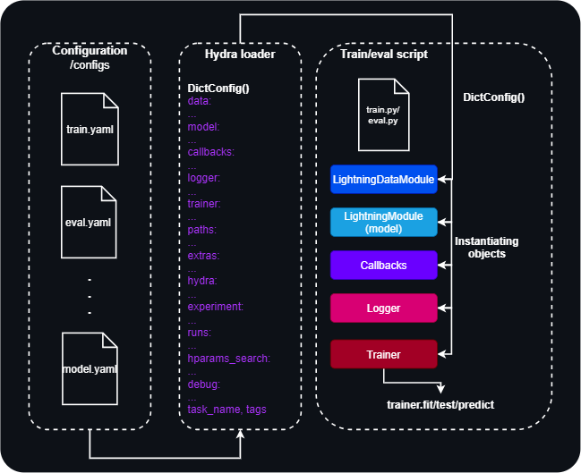
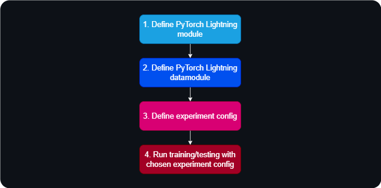

<div align='center'>

# DeepTrainer


<strong>Versatile model training environment</strong>  

[](https://pytorch.org/get-started/locally/)
[](https://pytorchlightning.ai/)
[](https://hydra.cc/)
[](https://wandb.ai/site)

</div>

## Project Description
Neural network training environment (including various MLOps tools).
[PyTorch Lightning](https://github.com/Lightning-AI/lightning) and [Hydra](https://github.com/facebookresearch/hydra) serve as the foundation upon this template. It is designed to streamline experimentation, foster modularity, and simplify tracking and reproducibility:

✅ Minimal boilerplate code (easily add new models, datasets, tasks, experiments, and different accelerator configurations).

✅ Logging experiments to one place for easier comparison of performance metrics.

✅ Hyperparameter search integration.

## Quick start
#### Conda installation
```bash
# clone project
git clone https://github.com/lus105/DeepTrainer.git
# change directory
cd DeepTrainer
# update conda
conda update -n base conda
# create conda environment and install dependencies
conda env create -f environment.yaml -n DeepTrainer
# activate conda environment
conda activate DeepTrainer
```
Train mnist model with default configuration (check if environment is properly set up):
```bash
# train on CPU (mnist dataset)
python src/train.py trainer=cpu
# train on GPU (mnist dataset)
python src/train.py trainer=gpu
```

## Table of contents
- [Project structure](#project-structure)
- [Workflow](#workflow)
  - [Steps](#steps)
  - [LightningDataModule](#lightningdatamodule)
  - [LightningModule](#lightningmodule)
  - [Training loop](#training-loop)
  - [Evaluation and prediction loops](#evaluation-and-prediction-loops)
  - [Callbacks](#callbacks)
- [Hydra configs](#hydra-configs)
  - [How to run pipeline with Hydra](#how-to-run-pipeline-with-hydra)
  - [Instantiating objects with Hydra](#instantiating-objects-with-hydra)
  - [Command line operations](#command-line-operations)
  - [Custom config resolvers](#custom-config-resolvers)
  - [Simplify complex modules configuring](#simplify-complex-modules-configuring)
- [Hyperparameters search](#hyperparameters-search)
- [Docker](#docker)
- [Development](#development)
- [References](#references)

## Project structure
The structure of a machine learning project can vary depending on the specific requirements and goals of the project, as well as the tools and frameworks being used. However, here is a general outline of a common directory structure for a machine learning project:

- `src/`
- `data/`
- `logs/`
- `tests/`
- some additional directories, like: `notebooks/`, `docs/`, etc.

In this project, the directory structure looks like:

```
├── configs                     <- Hydra configuration files
│   ├── callbacks               <- Callbacks configs
│   ├── data                    <- Datamodule configs
│   ├── debug                   <- Debugging configs
│   ├── experiment              <- Experiment configs
│   ├── extras                  <- Extra utilities configs
│   ├── hparams_search          <- Hyperparameter search configs
│   ├── hydra                   <- Hydra settings configs
│   ├── local                   <- Local configs
│   ├── logger                  <- Logger configs
│   ├── model                   <- Model configs
│   ├── paths                   <- Project paths configs
│   ├── runs                    <- Run configs (top level)
│   ├── trainer                 <- Trainer configs
│   │
│   ├── eval.yaml               <- Main config for evaluation
│   └── train.yaml              <- Main config for training
│
├── data                        <- Project data
├── docs                        <- Resources, additional readme files
├── logs                        <- Logs generated by hydra, lightning loggers, etc.
├── notebooks                   <- Jupyter notebooks.
├── scripts                     <- Shell/bat scripts
│
├── src                         <- Source code
│   ├── data                    <- Lightning datamodules
│   ├── models                  <- Lightning modules
│   ├── utils                   <- Utility scripts
│   │
│   ├── eval.py                 <- Run evaluation
│   └── train.py                <- Run training
│
├── tests                       <- Tests of any kind
│
├── .dockerignore               <- List of files ignored by docker
├── .env.example                <- File for environment variables
├── .gitignore                  <- List of files ignored by git
├── .pre-commit-config.yaml     <- Pre-commit hooks for code formatting
├── Dockerfile                  <- Dockerfile
├── environment.yaml            <- Conda environment creation file
├── pyproject.toml              <- Configuration options for testing and linting
├── README.md                   <- Readme file
└── requirements.txt            <- File for installing python dependencies
```

## Workflow
<p align="center">
  
</p>

*Configuration*

This part of the diagram illustrates how configuration files (train.yaml, eval.yaml, model.yaml, etc.) are used to manage different aspects of the project, such as data preprocessing, model parameters, and training settings.

*Hydra Loader*

The diagram shows how Hydra loads all configuration files and combines them into a single configuration object (DictConfig). This unified configuration object simplifies the management of settings across different modules and aspects of the project, such as data handling, model specifics, callbacks, logging, and the training process.

*Train/eval script*

 This section represents the operational part of the project. Scripts train.py and eval.py are required for training and evaluatging the model. DictConfig: The combined configuration object passed to these scripts, guiding the instantiation of the subsequent components.

  * LightningDataModule: manages data loading and processing specific to training, validation, testing and predicting phases.

  * LightningModule (model): defines the model, including the computation that transforms inputs into outputs, loss computation, and metrics.

  *	Callbacks: provide a way to insert custom logic into the training loop, such as model checkpointing, early stopping, etc.

  * Logger: handles the logging of training, testing, and validation metrics for monitoring progress.

  *	Trainer: the central object in PyTorch Lightning that orchestrates the training process, leveraging all the other components.

  *	The trainer uses the model, data module, logger, and callbacks to execute the training/evaluating process through the trainer.fit/test/predict methods, integrating all the configuration settings specified through Hydra.

### Steps:
<p align="center">
  
</p>

1. Write your PyTorch Lightning Module (see example in [data/mnist_datamodule.py](src/data/mnist_datamodule.py))
2. Write your PyTorch Lightning DataModule (see examples in [models/mnist_module.py](src/models/mnist_module.py))
3. Fill up your configs, in particularly create experiment/runs configs
4. Run experiments:

Run training with chosen experiment config:
```shell
python src/train.py experiment=experiment_name
```
Use hyperparameter search, for example by Optuna Sweeper via Hydra:
```shell
# using Hydra multirun mode
python src/train.py -m hparams_search=mnist_optuna
```
Execute the runs with some config parameter manually:
```shell
python src/train.py -m logger=csv model.optimizer.weight_decay=0.,0.00001,0.0001
```
5. Run evaluation with different checkpoints or prediction on custom dataset for additional analysis

### LightningDataModule

At the start, you need to create PyTorch Dataset for you task. It has to include `__getitem__` and `__len__` methods. See more details in [PyTorch documentation](https://pytorch.org/tutorials/beginner/basics/data_tutorial.html).
Then, you need to create DataModule using [PyTorch Lightning DataModule API](https://pytorch-lightning.readthedocs.io/en/stable/data/datamodule.html#lightningdatamodule-api).
By default, API has the following methods:

- `prepare_data` (optional): perform data operations on CPU via a single process, like load and preprocess data, etc.
- `setup` (optional): perform data operations on every GPU, like train/val/test splits, create datasets, etc.
- `train_dataloader`: used to generate the training dataloader
- `val_dataloader`: used to generate the validation dataloader
- `test_dataloader`: used to generate the test dataloader
- `predict_dataloader` (optional): used to generate the prediction dataloader

See examples of `LightningDataModule` in [src/data](src/data) and [configs/data](configs/data).

### LightningModule
Next, create LightningModule using [PyTorch Lightning LightningModule API](https://pytorch-lightning.readthedocs.io/en/stable/common/lightning_module.html).
Minimum API has the following methods:

- `forward`: use for inference only (separate from training_step)
- `training_step`: the complete training loop
- `validation_step`: the complete validation loop
- `test_step`: the complete test loop
- `predict_step`: the complete prediction loop
- `configure_optimizers`: define optimizers and LR schedulers

Also, you can override optional methods for each step to perform additional logic:

- `training_step_end`: training step end operations
- `training_epoch_end`: training epoch end operations
- `validation_step_end`: validation step end operations
- `validation_epoch_end`: validation epoch end operations
- `test_step_end`: test step end operations
- `test_epoch_end`: test epoch end operations

See examples of `LightningModule` in [src/models](src/models) and [configs/model](configs/model).

### Training loop
[Training loop](src/train.py) in the template contains the following stages:

- LightningDataModule instantiating
- LightningModule instantiating
- Callbacks instantiating
- Loggers instantiating
- Trainer instantiating
- Hyperparameteres logging
- Training the model
- Testing the best model

See more details in [training loop](src/train.py) and [configs/train.yaml](configs/train.yaml).

### Evaluation and prediction loops
[Evaluation loop](src/eval.py) in the template contains the following stages:

- LightningDataModule instantiating
- LightningModule instantiating
- Callbacks instantiating
- Loggers instantiating
- Trainer instantiating
- Hyperparameteres logging
- Evaluating model or predicting

See more details in [evaluation loop](src/eval.py) and [configs/eval.yaml](configs/eval.yaml).

### Callbacks
PyTorch Lightning has a lot of [built-in callbacks](https://pytorch-lightning.readthedocs.io/en/stable/extensions/callbacks.html), which can be used just by adding them to callbacks config. See examples in [callbacks config](configs/callbacks) folder.

By default, the template contains the following callbacks:

- Model Checkpoint
- Early Stopping
- Model Summary
- Rich Progress Bar

## Hydra configs
[Hydra](https://github.com/facebookresearch/hydra) + [OmegaConf](https://omegaconf.readthedocs.io/en/) provide a flexible and efficient configuration management system that allows to dynamically create a hierarchical configurations
by composition and override it through config files and the command line.

This powerful tools allow to create a simple and efficient way for managing and organizing the various configurations in one place, constructing complex configurations structure without any limits which can be essential in machine learning projects.

All of that enable to easily switch between any parameters and try different configurations without having to manually update the code.

### How to run pipeline with Hydra
A decorator `hydra.main` is supposed to be used to load Hydra config during launching of the pipeline. Here a config
is being parser by Hydra grammar parser, merged, composed and passed to the pipeline main function.

```python
import hydra
from omegaconf import DictConfig, OmegaConf
from src.train import train


@hydra.main(version_base="1.3", config_path=".", config_name="train.yaml")
def main(cfg: DictConfig) -> None:
    print(OmegaConf.to_yaml(cfg))
    train(cfg)


if __name__ == "__main__":
    main()
```

### Instantiating objects with Hydra
For object instantiating from a config, it should contain `_target_` key with `class` or `function` name which
would be instantiated with other parameters passed to config. Hydra provides `hydra.utils.instantiate()` (and its alias
`hydra.utils.call()`) for instantiating objects and calling `class` or `function`. Prefer `instantiate` for creating
objects and `call` for invoking functions.

```yaml
loss:
  _target_: "torch.nn.CrossEntropyLoss"

metric:
  _target_: "torchmetrics.Accuracy"
  task: "multiclass"
  num_classes: 10
  top_k: 1
```

Based on such config you could instantiate loss via `loss = hydra.utils.instantiate(config.loss)` and metric via
`metric = hydra.utils.instantiate(config.metric)`.


### Command line operations
It supports few operations from the command line as well:

- Override existing config value by passing it as well
- Add a new config value, which doesn't exist in the config, by using `+`
- Override a config value if it's already in the config, or add it otherwise, by using `++`

```shell
# train the model with the default config
python src/train.py

# train the model with the overridden parameter
python src/train.py model.compile=true

# train the model with the overridden parameter and add a new parameter
python src/train.py model.compile=true ++model.model_repo="repository"
```


## Hyperparameters search
Hydra provides out-of-the-box hyperparameters sweepers: [Optuna, Nevergrad or Ax](https://hydra.cc/docs/plugins/optuna_sweeper/).

You can define hyperparameters search by adding new config file to [configs/hparams_search](configs/hparams_search).
See example of [hyperparameters search config](configs/hparams_search/mnist_optuna.yaml). With this method, there is no
need to add extra code, everything is specified in a single configuration file. The only requirement is to return the
optimized metric value from the launch file.

Execute it with:
```shell
python src/train.py -m hparams_search=mnist_optuna
```
The `optimization_results.yaml` will be available under `logs/task_name/multirun` folder.

## Docker
Build docker container:
```shell
docker build -t deeptrainer \
--build-arg CUDA_VERSION=12.5.1 \
--build-arg OS_VERSION=22.04 \
--build-arg PYTHON_VERSION=3.11 \
--build-arg USER_ID=$(id -u) \
--build-arg GROUP_ID=$(id -g) \
--build-arg NAME=$(whoami) \
--build-arg WORKDIR_PATH=/test .
```

Run container:

```shell
docker run \
-it \
--rm \
--gpus all \
--name my_deeptrainer_container \
-v host/data:/data \
deeptrainer
```

## Development
Linting all files in the project:
To run Ruff as a linter, try any of the following:

```shell
ruff check                          # Lint all files in the current directory (and any subdirectories).
ruff check path/to/code/            # Lint all files in `/path/to/code` (and any subdirectories).
ruff check path/to/code/*.py        # Lint all `.py` files in `/path/to/code`.
ruff check path/to/code/to/file.py  # Lint `file.py`.
```

Or, to run Ruff as a formatter:

```shell
ruff format                          # Format all files in the current directory (and any subdirectories).
ruff format path/to/code/            # Format all files in `/path/to/code` (and any subdirectories).
ruff format path/to/code/*.py        # Format all `.py` files in `/path/to/code`.
ruff format path/to/code/to/file.py  # Format `file.py`.
```

Tests:
```bash
# run all tests
pytest
# run tests from specific file
pytest tests/test_train.py
# run all tests except the ones marked as slow
pytest -k "not slow"
```

## References
* [ashleve/lightning-hydra-template](https://github.com/ashleve/lightning-hydra-template)