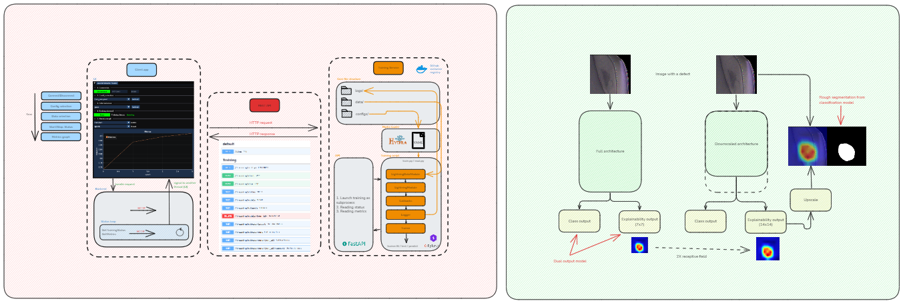

<div align='center'>

# DeepVisionXplain


**Neural network training environment with MLOps tools, training API, and model explainability**

[](https://pytorch.org/get-started/locally/)
[](https://pytorchlightning.ai/)
[](https://hydra.cc/)



</div>

---
## Features

- **Model Training**: PyTorch Lightning + Hydra configuration system
- **Training API**: FastAPI service for remote training management ([docs](docs/training_api.md))
- **Explainability**: CNN CAM and ViT Attention Rollout ([docs](docs/explainability.md))
- **Hyperparameter Optimization**: Integrated Optuna sweeps
- **MLOps**: W&B integration, checkpoint management, ONNX export

## Quick Start

**Installation:**
```bash
git clone https://github.com/lus105/DeepVisionXplain.git
cd DeepVisionXplain
conda env create -f environment.yaml -n DeepVisionXplain
conda activate DeepVisionXplain
copy .env.example .env # or cp .env.example .env
```

**Train a model:**
```bash
# CPU
python src/train.py trainer=cpu

# GPU
python src/train.py trainer=gpu

# Specific experiment
python src/train.py experiment=experiment_name
```

**Run Training API:**
```bash
# Development
fastapi dev src/api/main.py

# Docker
docker compose up --build

# Docker (Pre-built image)
docker-compose -f docker-compose.prod.yaml up
```

## Documentation

- [Training API Service](docs/training_api.md) - REST API for managing training processes
- [Model Explainability](docs/explainability.md) - CNN/ViT ante-hoc explainability methods

## Usage instructions

#### Model Training Options

**Hyperparameter optimization with Optuna:**
```bash
# CNN optimization
python src/train.py hparams_search=cnn_optuna experiment=train_cnn_multi

# ViT optimization
python src/train.py hparams_search=vit_optuna experiment=train_vit_multi
```

**Configuration overrides:**
```bash
# Override individual parameters
python src/train.py trainer=gpu data.batch_size=32 model.optimizer.lr=0.001

# Set seed for reproducibility
python src/train.py seed=12345

# Enable ONNX export
python src/train.py export_to_onnx=true
```

#### Testing

```bash
# Run all tests
pytest

# Run specific test file
pytest tests/test_train.py

```

#### Code Quality

```bash
# Format code
ruff format
```

#### Implementation Details

The project uses Hydra for hierarchical configuration management:

- **configs/train.yaml**: Main training configuration entry point
- **configs/experiment/**: Experiment-specific configs (train_cnn_multi.yaml, train_vit_multi.yaml, etc.)
- **configs/data/**: Data module configs (mnist.yaml, classification_dir.yaml)
- **configs/model/**: Model architecture configs (cnn_multi_*, vit_multi_*)
- **configs/trainer/**: PyTorch Lightning trainer configs (cpu.yaml, gpu.yaml, ddp.yaml)
- **configs/callbacks/**: Training callbacks (early_stopping.yaml, model_checkpoint.yaml, wandb.yaml)
- **configs/logger/**: Logging configs (wandb.yaml, tensorboard.yaml, csv.yaml)
- **configs/hparams_search/**: Optuna hyperparameter search configs

Configuration composition follows defaults list order, where later configs override earlier ones.

#### Training Pipeline (src/train.py)

The training pipeline follows this flow:

1. **Hydra initialization**: Loads and composes configs from `configs/train.yaml`
2. **Environment setup**: Loads `.env` variables, sets random seeds
3. **Component instantiation**: Creates datamodule, model, loggers, callbacks, trainer
4. **Training execution**: Runs `trainer.fit()` with the model and datamodule
5. **Testing**: Runs `trainer.test()` with best checkpoint
6. **ONNX export**: Optionally exports model to ONNX format with metadata

Key components are instantiated using `hydra.utils.instantiate()` based on `_target_` in configs.

#### Model Architecture

**LightningModule structure (src/models/classification_module.py):**
- `setup()`: Loads model architecture and pretrained weights if specified
- `model_step()`: Handles both binary (single neuron or 2-class) and multi-class classification
- `training_step()`, `validation_step()`, `test_step()`: Standard Lightning hooks
- `configure_optimizers()`: Sets up optimizer and optional LR scheduler

**Binary classification handling:**
- Single output neuron: Uses sigmoid activation and BCE loss
- Two output neurons: Uses softmax and cross-entropy loss
- Automatic detection based on `num_classes` and model output shape

**Explainability models:**
- **CNN with CAM** (src/models/components/cnn_cam_multihead.py): Uses FeatureExtractor to get intermediate feature maps, applies GAP and classification heads
- **ViT with Attention Rollout** (src/models/components/vit_rollout_multihead.py): Captures attention maps from transformer blocks, computes rollout for visualization

#### Data Module (src/data/classification_datamodule.py)

- Uses `ImageFolder` from torchvision for directory-based datasets
- Expected structure: `data/{dataset_name}/{train,test,val}/{class1,class2,...}`
- Automatically extracts class names from directory structure
- `dataset_name` property derived from parent directory name
- Supports custom transforms for train vs val/test splits

#### Logging and Outputs

**Directory structure:**
- `logs/train/runs/{timestamp}/`: Training run outputs
  - `checkpoints/`: Model checkpoints (.ckpt, .onnx)
  - `csv/version_0/metrics.csv`: Training metrics (when using CSV logger)
  - `classification_model.json`: Model metadata (class names, paths, metrics)

**Model metadata format:**
```json
{
  "model_path": "/absolute/path/to/model.onnx",
  "dataset_name": "MNIST",
  "class_names": ["class1", "class2"],
  "train_metrics": {"train/loss": 0.1, "train/acc": 0.95},
  "test_metrics": {"test/loss": 0.12, "test/acc": 0.93}
}
```

## Resources

- [Research paper](https://ieeexplore.ieee.org/document/10348813)
- [Master's project](https://epubl.ktu.edu/object/elaba:198846619/)
