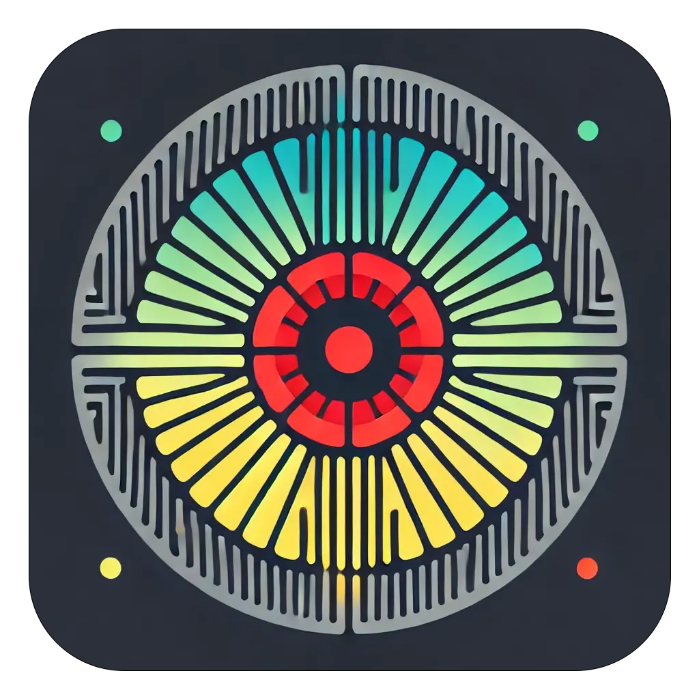

<div align='center'>

# DeepVisionXplain


<strong>ViT and CNN explainability comparison</strong>  

[](https://pytorch.org/get-started/locally/)
[](https://pytorchlightning.ai/)
[](https://hydra.cc/)
[](https://wandb.ai/site)

</div>

## Project Description
Neural network training environment (including various MLOps tools) designed to compare the explainability of CNNs (using Class Activation Maps) and ViTs (using attention rollout). Project is based on [DeepTrainer](https://github.com/lus105/DeepTrainer).

<p align="center">
  
</p>

#### Conda installation
```bash
# clone project
git clone https://github.com/lus105/DeepVisionXplain.git
# change directory
cd DeepVisionXplain
# update conda
conda update -n base conda
# create conda environment and install dependencies
conda env create -f environment.yaml -n DeepVisionXplain
# activate conda environment
conda activate DeepVisionXplain
```
#### Quickstart
Train model with default configuration (check if environment is properly set up):
```bash
# train on CPU (mnist dataset)
python src/train.py trainer=cpu
# train on GPU (mnist dataset)
python src/train.py trainer=gpu
```

## Modified ViT architecture
<p align="center">
  
</p>

## Modified CNN architecture
<p align="center">
  
</p>

Two cnn models were trained for experimentation.
```bash
full size: efficientnet_v2_s. features.7 -> [1, 1280, 7, 7]
downscaled: efficientnet_v2_s. features.6.0.block.0 -> [1, 960, 14, 14]
full size: mobilenet_v3_large. features.16 -> [1, 960, 7, 7]
downscaled: mobilenet_v3_large. features.13.block.0 -> [1, 672, 14, 14]
```

Train cnn/vit model:
```bash
# train cnn
python src/train.py experiment=train_cnn
# train vit
python src/train.py experiment=train_vit
```
Train cnn/vit model with hparams search:
```bash
# train cnn
python src/train.py hparams_search=cnn_optuna experiment=train_cnn

# train vit
python src/train.py hparams_search=vit_optuna experiment=train_vit
```

Run explainability segmentation evaluation for all models:
```bash
scripts\eval_segmentation.bat
```


## Resources

* [Research paper](https://epubl.ktu.edu/object/elaba:198846619/)
* Defect detection [datasets](https://drive.google.com/drive/folders/10yYU8yl3um0c1oq6-uVjHp5ORZWXi_tQ?usp=sharing).
* Experiment [logs](https://wandb.ai/team_deepvisionxplain?shareProfileType=copy).
* Trained [models](https://huggingface.co/DeepVisionXplain).

## References

* [lus105/DeepTrainer](https://github.com/lus105/DeepTrainer)
* [jacobgil/vit-explain](https://github.com/jacobgil/vit-explain)
* [rytiss/DL-defect-classification-with-CAM-output](https://github.com/rytisss/DL-defect-classification-with-CAM-output)