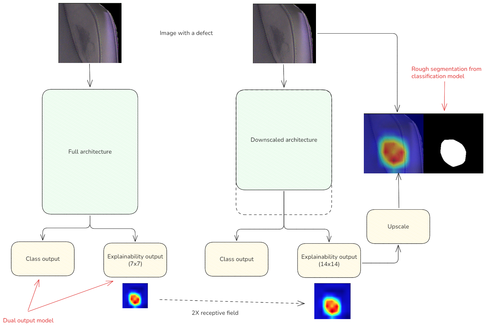
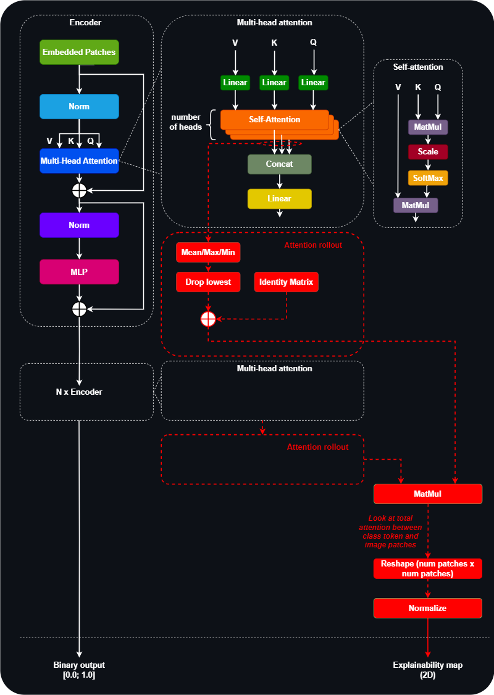
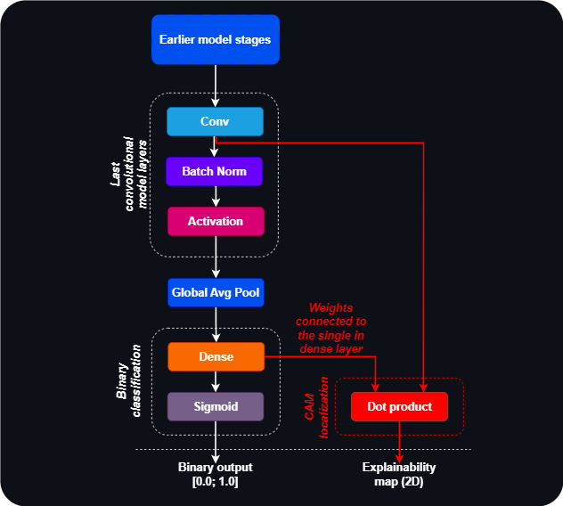

## CNN/ViT (ante-hoc) explainability
This module provides ante-hoc explainability methods for CNN and ViT models using Class Activation Mapping (CAM) and Attention Rollout techniques, respectively. The explainability methods are integrated into modified model architectures to generate visual explanations during inference.

<p align="center">
  
</p>

#### Modified ViT architecture ([code](../src/models/components/vit_rollout_multihead.py))

<p align="center">
  
</p>

#### Modified CNN architecture ([code](../src/models/components/cnn_cam_multihead.py))

<p align="center">
  
</p>

Train cnn/vit model:
```bash
# train cnn
python src/train.py experiment=train_cnn_multi
# train vit
python src/train.py experiment=train_vit_multi
```

Train cnn/vit model with hparams search:
```bash
# train cnn
python src/train.py hparams_search=cnn_optuna experiment=train_cnn_multi
# train vit
python src/train.py hparams_search=vit_optuna experiment=train_vit_multi
```


## Research

- [Research paper](https://ieeexplore.ieee.org/document/10348813)
- [Master's project](https://epubl.ktu.edu/object/elaba:198846619/)
