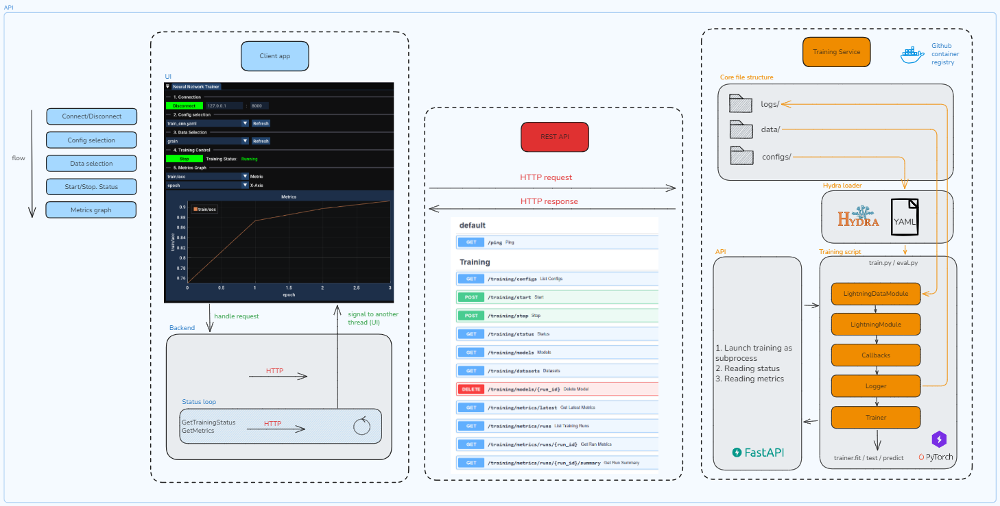

# Training API service

A FastAPI-based service for managing deep learning model training processes.

## Overview

The Training API provides endpoints to start, stop, monitor training processes, and retrieve training metrics. It uses a background subprocess approach to run training scripts while maintaining API responsiveness. The API includes comprehensive metrics tracking with support for PyTorch Lightning CSV logs and dataset discovery functionality.

Architecture diagram:
<p align="center">
  
</p>

## Run service (using Docker)
```bash
cd DeepVisionXplain
# Create .env file (from .env.example) and specify required paths

# Build and run the Docker container
docker-compose up --build
# Open documentation
http://127.0.0.1:8000/docs
```

## Run service (from source)
```bash
cd DeepVisionXplain
# Activate conda environment
conda activate DeepVisionXplain
# Development mode
fastapi dev src/api/main.py
# Production mode
fastapi run src/api/main.py
# Open documentation
http://127.0.0.1:8000/docs
```

## Health Check
The API includes a simple health check endpoint:
```http
GET /ping
```
**Response:**
```json
{
  "status": "ok"
}
```


## Core Endpoints

### Training Management

#### Start Training
```http
POST /training/start
```
Starts a new training process with specified configuration.

**Request Body:**
```json
{
  "config_name": "experiment_config.yaml",
  "model_name": "default",
  "train_data_dir": "data/train",
  "test_data_dir": "data/test", 
  "val_data_dir": "data/val"
}
```

**Response:**
```json
{
  "status": "started"
}
```

#### Stop Training
```http
POST /training/stop
```
Stops the currently running training process.

**Response:**
```json
{
  "status": "stopped"
}
```

#### Get Status
```http
GET /training/status
```
Returns current training process status.

**Response:**
```json
{
  "status": "running"
}
```

### Configuration & Models

#### List Configurations
```http
GET /training/configs
```
Lists available training configuration files from the `configs/experiment/` directory.

**Response:**
```json
{
  "available_configs": ["config1.yaml", "config2.yaml"]
}
```

#### Get Trained Models
```http
GET /training/trained_models
```
Returns paths to trained model files (searches for `*.onnx` files in `logs/train/runs/`).

**Response:**
```json
{
  "model_paths": ["/path/to/model1.onnx", "/path/to/model2.onnx"]
}
```

#### Get Available Datasets
```http
GET /training/datasets
```
Returns available datasets with their actual directory paths. Scans the `data/` directory for folders containing `train/` and `test/` subdirectories.

**Response:**
```json
{
  "datasets": [
    {
      "dataset_name": "MNIST",
      "train_path": "/absolute/path/to/data/MNIST/train",
      "test_path": "/absolute/path/to/data/MNIST/test", 
      "val_path": "/absolute/path/to/data/MNIST/val",
      "dataset_base_path": "/absolute/path/to/data/MNIST"
    }
  ]
}
```

### Metrics Tracking

The API provides comprehensive metrics tracking functionality that works with PyTorch Lightning CSV log files.

#### Get Latest Metrics
```http
GET /training/metrics/latest
```
Returns metrics from the most recent training run.

**Response:**
```json
{
  "run_id": "run_2024_01_15_14_30_45",
  "available_columns": ["epoch", "step", "train_loss", "val_loss", "val_acc"],
  "total_rows": 100,
  "max_epoch": 99,
  "max_step": 999,
  "data": [
    {
      "epoch": 0,
      "step": 0,
      "train_loss": 2.3,
      "val_loss": 2.1,
      "val_acc": 0.1
    }
  ],
  "csv_file": "/path/to/logs/train/runs/run_id/csv/version_0/metrics.csv",
  "last_modified": "2024-01-15T14:30:45"
}
```

**Error Response:**
```json
{
  "error": "No training runs found"
}
```

#### List Training Runs
```http
GET /training/metrics/runs
```
Lists all available training runs with metadata.

**Response:**
```json
[
  {
    "run_id": "run_2024_01_15_14_30_45",
    "created_at": "2024-01-15T14:30:45",
    "modified_at": "2024-01-15T16:45:30",
    "status": "completed",
    "has_metrics": true,
    "metrics_file": "/path/to/metrics.csv"
  }
]
```

#### Get Run Metrics
```http
GET /training/metrics/runs/{run_id}
```
Returns detailed metrics for a specific training run.

**Response:** Same format as latest metrics endpoint.

**Error Response:**
```json
{
  "error": "Run {run_id} not found"
}
```

#### Get Run Summary
```http
GET /training/metrics/runs/{run_id}/summary
```
Returns summary statistics for a specific training run.

**Response:**
```json
{
  "run_id": "run_2024_01_15_14_30_45",
  "total_epochs": 99,
  "total_steps": 999,
  "best_metrics": {
    "best_train_loss": 0.05,
    "best_val_loss": 0.08,
    "best_val_acc": 0.95
  },
  "final_metrics": {
    "epoch": 99,
    "step": 999,
    "train_loss": 0.06,
    "val_loss": 0.09,
    "val_acc": 0.94
  },
  "available_columns": ["epoch", "step", "train_loss", "val_loss", "val_acc"]
}
```

## Status Values

- `started` - Training process has been initiated
- `running` - Training is currently in progress  
- `stopped` - Training has been stopped
- `not_running` - No training process is active
- `error: {message}` - An error occurred during training

## Training Run Status Values

- `completed` - Training run finished and has metrics available
- `in_progress` - Training run is ongoing or stopped without metrics

## Configuration

- Training configurations are stored in `configs/experiment/` (`.yaml` files)
- Model outputs are saved to `logs/train/runs/`
- Trained models are searched in `logs/train/runs/` (`.onnx` files)
- Datasets are discovered in `data/` directory (requires `train/` and `test/` subdirectories)
- Metrics are automatically parsed from PyTorch Lightning CSV logs

## Usage Examples

### Health Check:
```bash
curl "http://localhost:8000/ping"
```

### Start a training session:
```bash
curl -X POST "http://localhost:8000/training/start" \
  -H "Content-Type: application/json" \
  -d '{
    "config_name": "my_experiment.yaml",
    "train_data_dir": "data/MNIST/train",
    "test_data_dir": "data/MNIST/test",
    "val_data_dir": "data/MNIST/val"
  }'
```

### Check training status:
```bash
curl "http://localhost:8000/training/status"
```

### Stop training:
```bash
curl -X POST "http://localhost:8000/training/stop"
```

### Get available datasets:
```bash
curl "http://localhost:8000/training/datasets"
```

### Get latest training metrics:
```bash
curl "http://localhost:8000/training/metrics/latest"
```

### List all training runs:
```bash
curl "http://localhost:8000/training/metrics/runs"
```

### Get specific run summary:
```bash
curl "http://localhost:8000/training/metrics/runs/run_2024_01_15_14_30_45/summary"
```

## Notes

- Only one training process can run at a time
- Training configurations are stored in `configs/experiment/`
- Model outputs are saved to `logs/train/runs/`
- All endpoints return JSON responses with appropriate HTTP status codes
- The API uses dependency injection for service management
- Metrics tracking supports PyTorch Lightning CSV log formats with automatic pattern detection
- Dataset discovery requires directories with both `train/` and `test/` subdirectories (optional `val/`)
